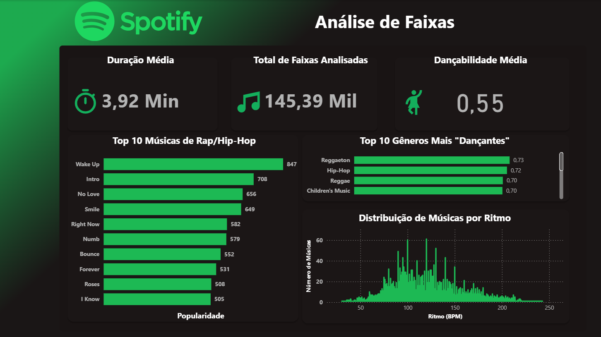

# Análise de Dados do Spotify com Python, SQL e Power BI

Este projeto realiza uma análise exploratória completa de um dataset contendo mais de 230.000 músicas do Spotify. O objetivo principal é transformar dados brutos em um dashboard interativo e informativo, passando por todas as etapas de um projeto de Business Intelligence: preparação dos dados, armazenamento, consulta e visualização.

O painel final responde a perguntas sobre popularidade de artistas e gêneros, características musicais (como dançabilidade, energia e ritmo) e as principais tendências encontradas nos dados.

## 📊 Dashboard Final

O dashboard interativo foi desenvolvido no Power BI para consolidar todos os insights de forma clara e visual. Ele apresenta os principais KPIs, análises de correlação, distribuição e rankings.

*(Aqui você deve colocar a imagem do seu dashboard. Faça o upload da imagem para o repositório e substitua o link abaixo)*

## 🚀 Principais Análises e Insights

O painel foi construído para responder às seguintes perguntas:

* **KPIs Gerais:** Qual a contagem total de músicas, a duração média e a popularidade média do catálogo?
* **Características Musicais:** Qual o perfil de ritmo (BPM) mais comum das músicas?
* **Análise de Gêneros:** Quais são os 10 gêneros mais "dançantes"?
* **Ranking:** Quais são as músicas e artistas mais populares do dataset?

## 🛠️ Ferramentas Utilizadas

* **Linguagem de Programação:** Python
* **Bibliotecas Python:** Pandas (para manipulação e limpeza de dados)
* **Banco de Dados:** SQLite (para armazenamento e consultas SQL)
* **Visualização de Dados:** Power BI (para criação do dashboard)

## 👨‍💻 Autor

* **LinkedIn:** [Seu Perfil do LinkedIn]